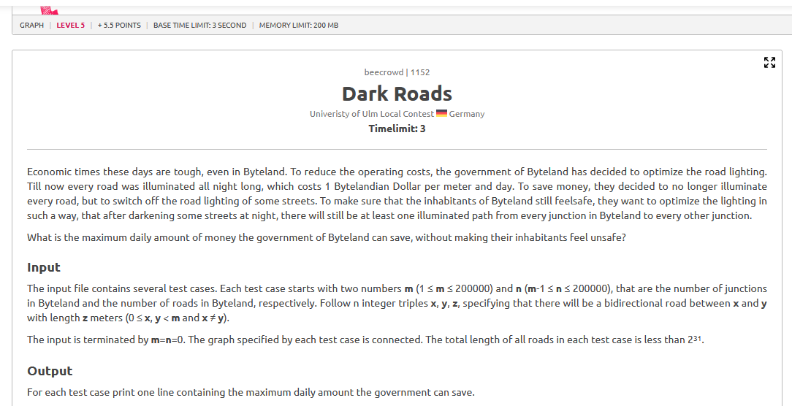
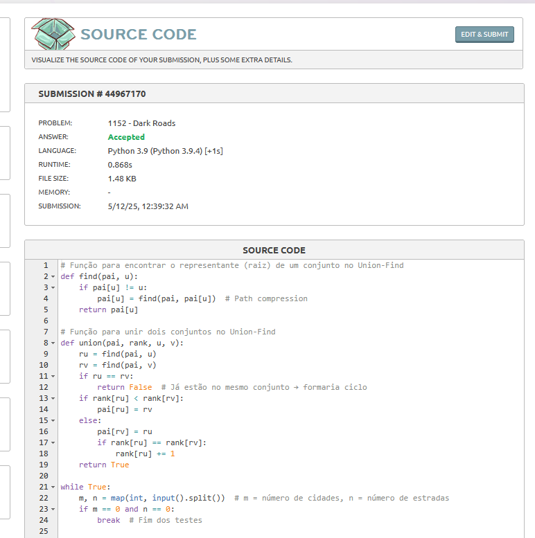

# Dark Roads

## Contextualização

A proposta do problema "Dark Roads" é otimizar os gastos com a iluminação pública nas estradas de uma cidade. A ideia é desligar o maior número possível de lâmpadas, desde que todas as cidades permaneçam conectadas de alguma forma, garantindo segurança aos moradores.

Em relação ao Grafos, o objetivo é encontrar a **árvore geradora mínima** (MST – Minimum Spanning Tree) e subtrair seu custo do total original da rede, indicando assim quanto pode ser economizado.

## Estratégia Utilizada

Para resolver o problema, foi implementado o algoritmo de Kruskal, utilizando a estrutura de Union-Find (Disjoint Set Union) para evitar ciclos durante a construção da MST.

Dessa forma, somar o custo total de todas as estradas da cidade, ordenar as estradas por custo crescente, adicionar as menores estradas possíveis, desde que não formem ciclos. Ao final, subtrair o custo da MST do custo total, resultando no valor que pode ser economizado ao desligar as estradas restantes.

## Código

[Código](grafos-2/beecrowd-1152-dark_roads/dark_roads.py)

## Resultado

O algoritmo obteve sucesso em todos os testes, retornando o valor correto, garantindo conectividade com o menor custo.

