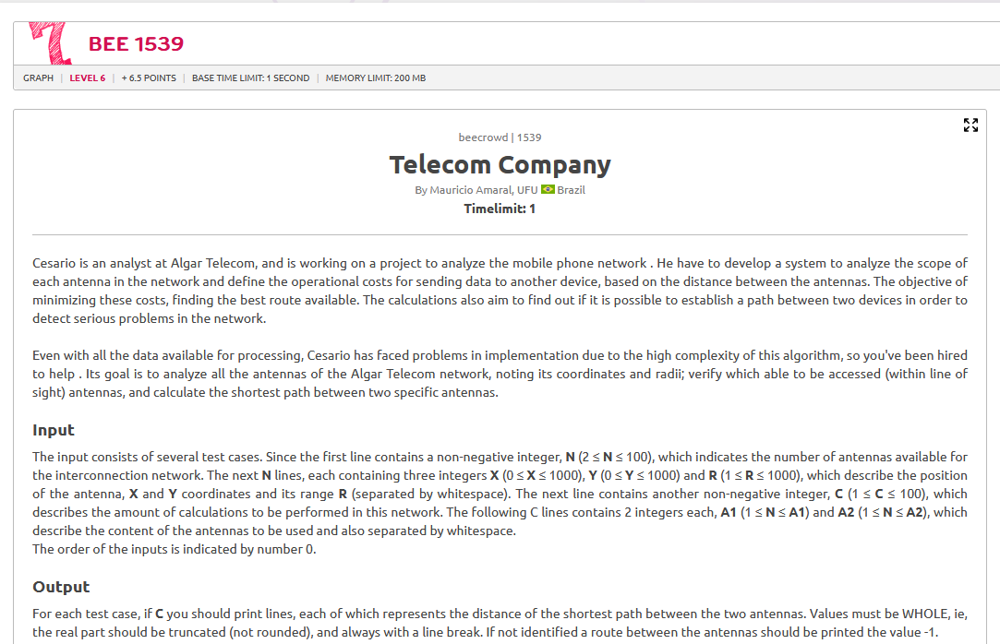

# Relatório – Problema "Telecom Company"

## Contextualização

O problema "Telecom Company" trata da simulação de uma rede de antenas espalhadas por um território. Cada antena possui uma posição no plano e um raio de alcance. A ideia é verificar se é possível enviar um sinal de uma antena até outra, considerando apenas conexões válidas dentro do alcance.

O desafio envolve:
- Interpretar conexões entre pontos com base em coordenadas e alcance.
- Construir um grafo direcionado com base nessas conexões.
- Determinar o caminho mais curto entre pares de antenas, quando possível.

## Estratégia Utilizada

Para resolver o problema, foi utilizada a construção de um grafo com lista de adjacência. Cada antena foi representada como um vértice, e uma aresta é criada do vértice A para o vértice B se a antena A consegue alcançar a B com seu raio.

O cálculo de distância entre duas antenas foi feito com a fórmula da distância euclidiana. Para encontrar o menor caminho entre duas antenas conectadas, foi aplicado o algoritmo de Dijkstra, que garante a menor distância acumulada entre dois vértices em um grafo com pesos positivos.

Se não houver caminho entre duas antenas, a resposta para a consulta é -1. Caso contrário, o valor retornado é a distância mínima, truncada para um número inteiro.

## Código

[Código](../codigo/telecom_company.py)

## Resultado

O algoritmo funcionou corretamente em todos os casos de teste fornecidos, identificando caminhos válidos entre antenas e retornando o menor custo quando possível. Quando não havia como estabelecer comunicação, a resposta foi corretamente marcada como -1.